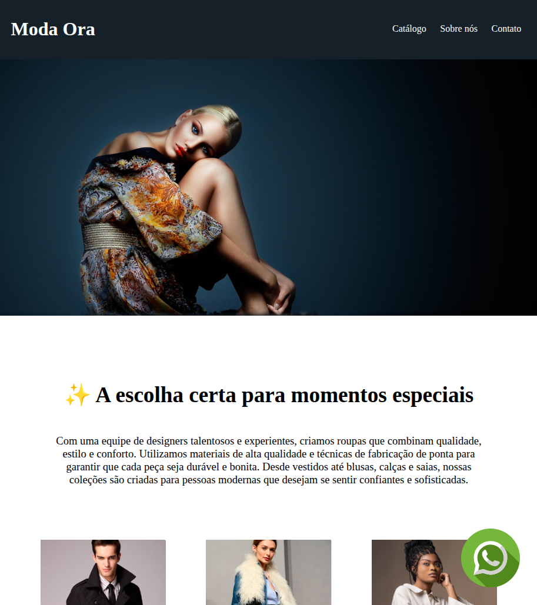
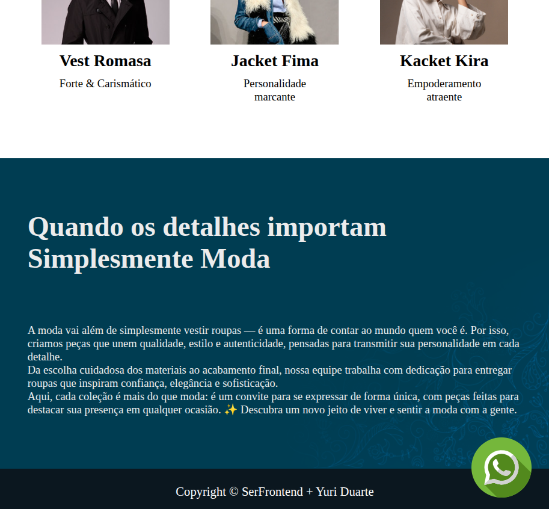

# 👗 Quarto Desafio – Projeto Moda Ora (HTML & CSS)  

Este repositório contém o **quarto desafio** que desenvolvi no curso **SerFrontend**, como parte do meu estágio na **SULTS**.  
O objetivo foi recriar do zero uma página para uma marca de moda, utilizando apenas **HTML e CSS**, aplicando conceitos de layout, tipografia, responsividade e boas práticas de design.  

---

## 📸 Demonstração do Projeto  
  
  

---

## 📖 Descrição  

Neste projeto, aprendi a:  
- Criar **estrutura semântica em HTML** para uma página de moda.  
- Trabalhar com **layouts de destaque** (banner principal + catálogo).  
- Utilizar **tipografia e hierarquia visual** para melhorar a leitura.  
- Aplicar **variáveis CSS** para manter consistência nas cores.  
- Posicionar ícones fixos na tela (como o botão do WhatsApp).  
- Desenvolver um **site responsivo** que se adapta a diferentes telas.  

Esse desafio trouxe a experiência de montar uma **landing page completa**, próxima de um caso real de uso no mercado.  

---

## 👤 Autor  
**Yuri Duarte**  

---

## 📚 Referências  
Este projeto faz parte do curso:  
👉 [SerFrontend – Curso HTML, CSS e JS](https://serliv.com/html-css-js)  

---
